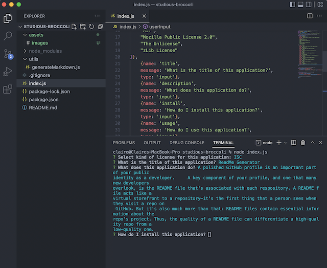

# ReadMe Generator

  ## Badges
  [](https://opensource.org/licenses/ISC)

  ## Table of Contents
  * [License](#license)
  * [Description](#description)
  * [Installation](#installation)
  * [Usage](#usage)
  * [How to Contribute](#how-to-contribute)
  * [Tests](#tests)
  * [Questions](#questions)

  ## License
  Read more about ISC here:
  [ISC] (https://opensource.org/licenses/ISC)

  ## Description
  A polished GitHub profile is an important part of your public identity as a developer.     A key component of your profile, and one that many new developers overlook, is the README file that's associated with each respository. A README file acts like a virtual storefront to a repository—it's the first thing that a person sees when they visit a repo on GitHub. But it's also much more than that: README files contain essential information about the repo's project. Thus, the quality of a README file can differentiate a high-quality repo from a low-quality one.  
    [Link to Sample Video](https://drive.google.com/file/d/1HjFIedWrlK5hIZJ117WUQeocG5Hzq7rJ/view)

   


  ## Installation
  1. Download the starter code from GitHub.
  2. Install dependencies using "npm install".  
  3. Now you are ready to use!

  ## Usage
  This command-line application dynamically generates a README.md from a user's input. The application will be invoked with the following command:   ```md node index.js``` You will be taken through a series of prompts. Answer them in as much detail as possible. Then A READme file is generated. 
     

  ## How to Contribute
  [Contributor Information](https://docs.github.com/en/communities/setting-up-your-project-for-healthy-contributions/setting-guidelines-for-repository-contributors)  
  If you created an application or package and would like other developers to contribute to it, you will want to add guidelines for how to do so. 

  ## Tests
  Go the extra mile and write tests for your application.

  ## Questions?
  ### Reach me here: 
  [claire-max](https://github.com/claire-max)  
  claire@robingoodfoods.com